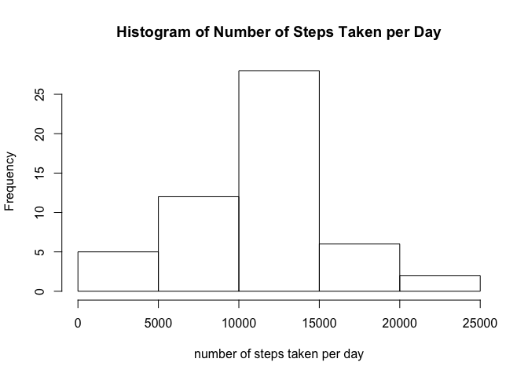
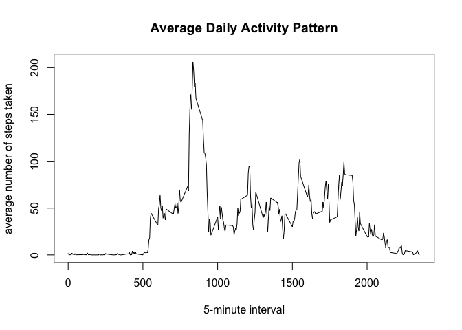
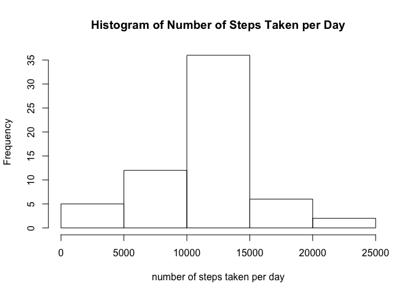
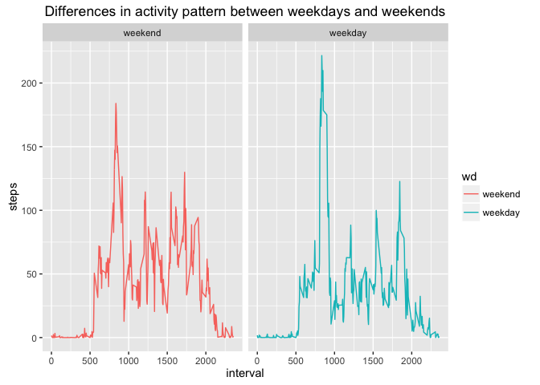

# Reproducible Research: Peer Assessment 1


## Loading and preprocessing the data

After we setup the working directory, we are going to load the data.


```r
setwd("~/datascience/05 reproducible research/RepData_PeerAssessment1-master")
data <- read.csv("activity.csv", header = T)
```


## What is mean total number of steps taken per day?
We will calculate the total number of steps taken per day.

```r
dsteps <- tapply(data$steps, data$date, sum)
ds <- as.data.frame(dsteps)
ds$date <- rownames(ds)
```

Then we will make a histogram of the step number taken per day.

```r
hist(ds$dsteps, main = "Histogram of Number of Steps Taken per Day", xlab = "number of steps taken per day")
```

<!-- -->

we will report the mean and median number of steps taken each day.


```r
mean = mean(ds$dsteps, na.rm = T)
median = median(ds$dsteps, na.rm = T)
```
The mean of total number of steps taken per day is 1.0766189\times 10^{4}.
The median of total number of steps taken per day is 10765.


## What is the average daily activity pattern?
First we will calculate the average number of steps in 5-minute interval across all days.


```r
asteps <- tapply(data$steps, data$interval, mean, na.rm = T)
as <- as.data.frame(asteps)
as$interval <- rownames(as)
```

Then we will make a time series plot of the average number of steps taken.


```r
plot(as$interval, as$asteps, type = "l", 
     xlab = "5-minute interval", 
     ylab = "average number of steps taken", 
     main = "Average Daily Activity Pattern")
```

<!-- -->

We will find out which 5-minutes interval contains the maximum number of steps.

```r
ms <- as[as$asteps == max(as$asteps),]
minter<- ms$interval
msteps<- ms$asteps
```
So the 835 interval contains the maximum number of steps, which is 206.1698113. 


## Imputing missing values
Caculate and report the total number of missing values in the dataset.


```r
mdata <- data[is.na(data$steps) == T,] ### missing data
vdata <- data[is.na(data$steps) == F,] ### data with values
```
The total number of missing values is 2304

Then we will fill in all of the missing values in the dataset by using the mean for that 5-minute interval.


```r
mdata1 <- merge(mdata, as, by = "interval")
colnames(mdata1) <- c("interval", "nasteps", "date", "steps")
mdata2 <- subset(mdata1, select = -nasteps)

newdata <- rbind(vdata, mdata2) ### new dataset
newdata <- newdata[order(newdata$date, newdata$interval),] ### order the dataset
```

Now we will make a histogram and calculate the mean and median of the total number of steps taken each day based on the new dataset.


```r
newsteps <- tapply(newdata$steps, newdata$date, sum)
ns <- as.data.frame(newsteps)
ns$date <- row.names(ns)

hist(ns$newsteps, main = "Histogram of Number of Steps Taken per Day", xlab = "number of steps taken per day")
```

<!-- -->

```r
nmean = mean(ns$newsteps)
nmedian = median(ns$newsteps)
```
The mean of total number of steps taken per day is 1.0766189\times 10^{4}.
The median of total number of steps taken per day is 1.0766189\times 10^{4}.
Because we impute the missing value by using the mean for that 5-minitue interval, so the mean of total number of steps is the same with previous dataset. However, the median is different which is larger than the one in previous dataset.

## Are there differences in activity patterns between weekdays and weekends?
First we should find out the weekdays and weekends and aggregate data based on that.


```r
newdata$date <- as.Date(newdata$date)
wd1 <- c("Monday", "Tuesday", "Wednsday", "Thursday", "Friday")
newdata$wd <- factor((weekdays(newdata$date) %in% wd1),
                     levels = c(FALSE, TRUE), 
                     labels = c("weekend", "weekday"))

weekdata <- with(newdata, aggregate(steps, list(interval, wd), mean))
colnames(weekdata) <- c("interval", "wd", "steps")
```

Then we will make a panel plot to show the differences in activity pattern between weekdays and weekends.

```r
library(ggplot2)
```

```
## Warning: package 'ggplot2' was built under R version 3.1.3
```

```r
ggplot(data = weekdata, aes(x = interval, y = steps, col = wd))+
               geom_line() +
               facet_grid(. ~ wd) +
               ggtitle("Differences in activity pattern between weekdays and weekends")
```

<!-- -->
